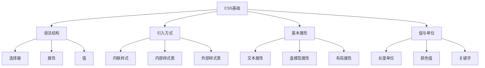

# CSS基础概念与语法

## 知识导图


## 基本语法

### CSS规则结构
```css
/* 选择器 { 属性: 值; } */
selector {
    property: value;
}

/* 示例 */
.button {
    background-color: blue;
    color: white;
    padding: 10px 20px;
}
```

## 引入方式

### 1. 内联样式
直接在HTML元素上使用style属性：
```html
<div style="color: blue; margin: 20px;">
    这是内联样式
</div>
```

### 2. 内部样式表
在HTML文件的`<head>`部分使用`<style>`标签：
```html
<head>
    <style>
        .container {
            width: 80%;
            margin: 0 auto;
        }
    </style>
</head>
```

### 3. 外部样式表
通过`<link>`标签引入外部CSS文件：
```html
<head>
    <link rel="stylesheet" href="styles.css">
</head>
```

## 基本属性

### 1. 文本样式
```css
p {
    /* 字体相关 */
    font-family: Arial, sans-serif;
    font-size: 16px;
    font-weight: bold;
    
    /* 文本相关 */
    color: #333;
    text-align: center;
    line-height: 1.5;
    text-decoration: underline;
}
```

### 2. 盒模型基础
```css
.box {
    /* 内容区域 */
    width: 200px;
    height: 100px;
    
    /* 内边距 */
    padding: 20px;
    
    /* 边框 */
    border: 1px solid #ccc;
    
    /* 外边距 */
    margin: 10px;
}
```

### 3. 背景属性
```css
.element {
    background-color: #f0f0f0;
    background-image: url('image.jpg');
    background-repeat: no-repeat;
    background-position: center;
    background-size: cover;
}
```

## 值与单位

### 1. 长度单位
```css
.element {
    /* 绝对单位 */
    width: 100px;     /* 像素 */
    margin: 1in;      /* 英寸 */
    padding: 1cm;     /* 厘米 */
    
    /* 相对单位 */
    font-size: 1.2em;    /* 相对于父元素 */
    width: 50%;          /* 百分比 */
    padding: 1rem;       /* 相对于根元素 */
    margin: 1vw;         /* 视窗宽度的1% */
}
```

### 2. 颜色值
```css
.element {
    /* 关键字 */
    color: red;
    
    /* 十六进制 */
    background-color: #ff0000;
    
    /* RGB */
    border-color: rgb(255, 0, 0);
    
    /* RGBA */
    background-color: rgba(255, 0, 0, 0.5);
    
    /* HSL */
    color: hsl(0, 100%, 50%);
    
    /* HSLA */
    background-color: hsla(0, 100%, 50%, 0.5);
}
```

## 注释
```css
/* 单行注释 */

/*
 * 多行注释
 * 可以包含多行内容
 * 便于代码说明
 */
```

## 常见问题与解决方案

### 1. 样式优先级
- 内联样式 > ID选择器 > 类选择器 > 标签选择器
- `!important` 可以提升优先级（谨慎使用）

### 2. 样式继承
某些属性会自动继承父元素的值：
```css
body {
    font-family: Arial;  /* 会被子元素继承 */
    color: #333;        /* 会被子元素继承 */
}
```

### 3. 常见错误
- 忘记分号
- 属性名拼写错误
- 值的单位使用错误
- 选择器写法错误

## 调试技巧

1. 使用浏览器开发者工具
2. 使用CSS验证工具
3. 检查CSS规则是否被覆盖
4. 查看计算后的样式

## 相关链接
- [[CSS选择器系统]]
- [[CSS盒模型详解]]
- [[CSS值与单位详解]]
- [[CSS调试技巧]]

## 练习题
1. 创建一个包含不同文本样式的段落
2. 实现一个带边框和内边距的卡片
3. 使用不同的颜色表示方法实现相同的视觉效果
4. 练习不同长度单位的使用 