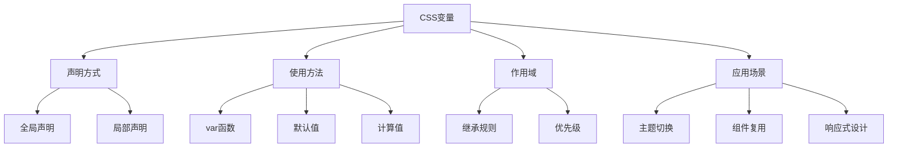

# CSS变量与自定义属性

## 知识导图


## 基本概念
CSS变量（自定义属性）允许我们定义可重用的值，这些值可以在整个样式表中引用。

### 声明语法
```css
/* 全局变量 */
:root {
  --primary-color: #007bff;
  --spacing-unit: 8px;
  --max-width: 1200px;
}

/* 局部变量 */
.component {
  --component-bg: #f0f0f0;
  --component-padding: 1rem;
}
```

### 使用方法
```css
.button {
  /* 基本使用 */
  background-color: var(--primary-color);
  
  /* 带默认值 */
  padding: var(--button-padding, 1rem);
  
  /* 计算值 */
  margin: calc(var(--spacing-unit) * 2);
}
```

## 变量继承
CSS变量遵循DOM树的继承规则，子元素可以访问父元素定义的变量。

```css
.parent {
  --text-color: blue;
}

.child {
  /* 继承父元素的变量 */
  color: var(--text-color);
}
```

## 动态修改
可以通过JavaScript动态修改CSS变量的值：

```javascript
// 修改全局变量
document.documentElement.style.setProperty('--primary-color', '#ff0000');

// 修改特定元素的变量
element.style.setProperty('--component-bg', '#e0e0e0');
```

## 实际应用

### 1. 主题切换
```css
/* 浅色主题 */
:root {
  --bg-color: #ffffff;
  --text-color: #333333;
  --border-color: #dddddd;
}

/* 深色主题 */
:root[data-theme="dark"] {
  --bg-color: #1a1a1a;
  --text-color: #ffffff;
  --border-color: #444444;
}
```

### 2. 响应式设计
```css
:root {
  --container-width: 1200px;
}

@media (max-width: 768px) {
  :root {
    --container-width: 100%;
    --font-size: 14px;
  }
}
```

### 3. 组件变体
```css
.button {
  --button-bg: var(--primary-color);
  --button-color: white;
  background: var(--button-bg);
  color: var(--button-color);
}

.button-secondary {
  --button-bg: var(--secondary-color);
}
```

## 最佳实践

1. 变量命名
   - 使用描述性名称
   - 采用一致的命名规范
   - 按功能或组件分组

2. 组织结构
   ```css
   :root {
     /* 颜色 */
     --color-primary: #007bff;
     --color-secondary: #6c757d;
     
     /* 间距 */
     --spacing-xs: 4px;
     --spacing-sm: 8px;
     --spacing-md: 16px;
     
     /* 字体 */
     --font-size-base: 16px;
     --font-family-sans: -apple-system, BlinkMacSystemFont, sans-serif;
   }
   ```

3. 性能考虑
   - 避免过度使用变量
   - 合理设置默认值
   - 注意浏览器兼容性

## 相关链接
- [[CSS变量浏览器兼容性]]
- [[深色模式实现]]
- [[CSS变量与预处理器对比]]

## 练习题
1. 实现一个使用CSS变量的主题切换系统
2. 创建一个响应式组件库，使用CSS变量控制样式
3. 设计一个颜色系统，使用CSS变量管理 