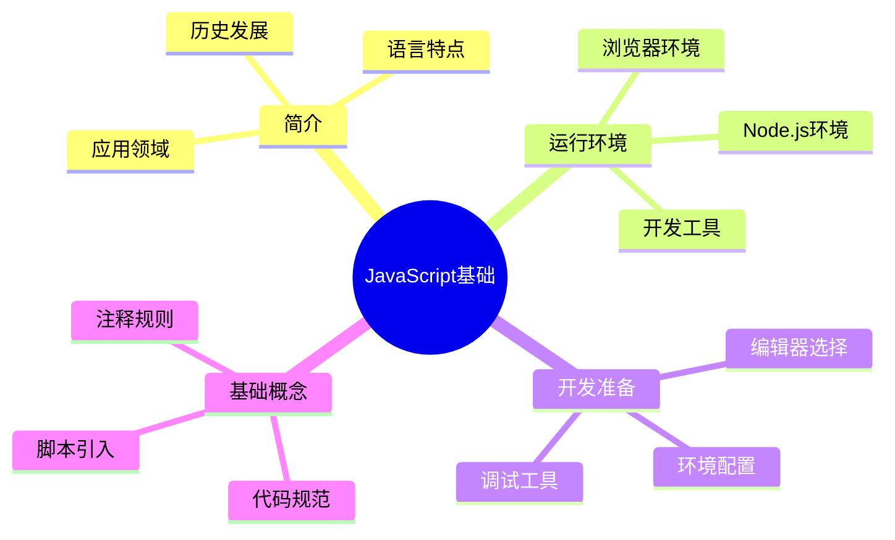

# JavaScript简介与环境搭建

## 知识导图


## JavaScript简介

### 什么是JavaScript？
JavaScript是一种轻量级、解释型或即时编译型的编程语言。它最初被设计用来为网页添加交互性，现在已发展成为一种功能强大的通用编程语言。

### 历史发展
1. 1995年：由Brendan Eich创造，最初名为Mocha
2. 1996年：改名为JavaScript，由ECMA标准化
3. 2009年：Node.js的出现使JavaScript进入服务器端
4. 2015年：ES6的发布带来重大更新
5. 现在：全栈开发的主流语言

### 语言特点
- 动态类型：变量类型在运行时确定
- 函数式编程：函数是一等公民
- 原型继承：基于原型的面向对象编程
- 事件驱动：异步编程模型
- 跨平台：浏览器、服务器、移动端都可运行

## 运行环境

### 浏览器环境
主流浏览器都内置了JavaScript引擎：
- Chrome：V8引擎
- Firefox：SpiderMonkey
- Safari：JavaScriptCore
- Edge：Chakra

### Node.js环境
- 基于Chrome V8引擎
- 用于服务器端JavaScript运行
- 提供丰富的系统API
- 强大的包管理系统(npm)

### 开发工具
1. 代码编辑器
   - Visual Studio Code
   - WebStorm
   - Sublime Text

2. 浏览器开发工具
   - Chrome DevTools
   - Firefox Developer Tools

3. 在线编程平台
   - CodePen
   - JSFiddle
   - CodeSandbox

## 环境搭建

### 编辑器安装
1. 下载安装VS Code
2. 安装推荐插件：
   - JavaScript (ES6) code snippets
   - ESLint
   - Prettier
   - Live Server

### Node.js安装
1. 访问Node.js官网下载安装包
2. 选择LTS（长期支持）版本
3. 完成安装后验证：
   ```bash
   node --version
   npm --version
   ```

### 开发环境配置
1. 配置编辑器
   - 设置自动保存
   - 配置代码格式化
   - 设置默认终端

2. 配置ESLint
   - 安装ESLint插件
   - 创建配置文件
   - 设置代码规范

## JavaScript使用方式

### 1. 内联脚本
```html
<script>
    // JavaScript代码
</script>
```

### 2. 外部脚本
```html
<script src="script.js"></script>
```

### 3. 事件属性
```html
<button onclick="handleClick()">点击</button>
```

## 代码规范

### 基本规则
1. 使用驼峰命名法
2. 语句结尾使用分号
3. 使用两空格或四空格缩进
4. 适当添加空格和换行

### 注释规范
1. 单行注释
```javascript
// 这是单行注释
```

2. 多行注释
```javascript
/*
 * 这是多行注释
 * 可以包含多行内容
 */
```

3. JSDoc注释
```javascript
/**
 * 函数说明
 * @param {string} name - 参数说明
 * @returns {boolean} 返回值说明
 */
```

## 调试技巧

### 浏览器调试
1. 使用console方法
   - console.log()
   - console.warn()
   - console.error()

2. 断点调试
   - 设置断点
   - 单步执行
   - 查看变量

### 开发者工具
1. 元素面板：查看DOM
2. 控制台：执行代码
3. 源代码面板：调试代码
4. 网络面板：监控请求

## 学习建议
1. 打好基础：理解核心概念
2. 多练习：编写简单程序
3. 查阅文档：遇到问题先看文档
4. 动手实践：跟着教程敲代码
5. 记录笔记：总结学习心得

## 常见问题
1. 代码无法运行
   - 检查语法错误
   - 确认文件引入正确
   - 查看控制台报错

2. 环境配置问题
   - 检查安装步骤
   - 确认版本兼容性
   - 查看官方文档

## 相关链接
- [[变量、数据类型与运算符]]
- [[流程控制与循环结构]]
- [[开发工具使用指南]]

## 练习题
1. 配置本地开发环境
2. 尝试不同方式引入JavaScript
3. 编写Hello World程序
4. 熟悉开发者工具的使用

## 现代JavaScript开发环境

### 包管理工具

1. npm（Node Package Manager）
```bash
# 初始化项目
npm init -y

# 安装依赖
npm install lodash
npm install --save-dev jest

# 运行脚本
npm run test
```

2. yarn
```bash
# 初始化项目
yarn init -y

# 安装依赖
yarn add lodash
yarn add --dev jest

# 运行脚本
yarn test
```

3. pnpm
```bash
# 安装pnpm
npm install -g pnpm

# 初始化项目
pnpm init

# 安装依赖
pnpm add lodash
pnpm add -D jest

# 运行脚本
pnpm test
```

### 构建工具

1. Vite - 现代前端构建工具
```bash
# 创建项目
npm create vite@latest my-app -- --template vanilla

# 安装依赖
cd my-app
npm install

# 启动开发服务器
npm run dev
```

2. webpack - 模块打包工具
```javascript
// webpack.config.js
const path = require('path');

module.exports = {
    entry: './src/index.js',
    output: {
        path: path.resolve(__dirname, 'dist'),
        filename: 'bundle.js'
    },
    module: {
        rules: [
            {
                test: /\.js$/,
                exclude: /node_modules/,
                use: {
                    loader: 'babel-loader'
                }
            }
        ]
    }
};
```

### 代码质量工具

1. ESLint配置
```javascript
// .eslintrc.js
module.exports = {
    env: {
        browser: true,
        es2021: true,
        node: true
    },
    extends: [
        'eslint:recommended',
        'plugin:@typescript-eslint/recommended'
    ],
    parser: '@typescript-eslint/parser',
    parserOptions: {
        ecmaVersion: 'latest',
        sourceType: 'module'
    },
    rules: {
        'indent': ['error', 4],
        'linebreak-style': ['error', 'unix'],
        'quotes': ['error', 'single'],
        'semi': ['error', 'always']
    }
};
```

2. Prettier配置
```json
// .prettierrc
{
    "semi": true,
    "singleQuote": true,
    "tabWidth": 4,
    "trailingComma": "es5",
    "printWidth": 80,
    "bracketSpacing": true,
    "arrowParens": "avoid"
}
```

3. Git Hooks配置
```json
// package.json
{
    "scripts": {
        "prepare": "husky install"
    },
    "husky": {
        "hooks": {
            "pre-commit": "lint-staged"
        }
    },
    "lint-staged": {
        "*.{js,jsx,ts,tsx}": [
            "eslint --fix",
            "prettier --write"
        ]
    }
}
```

### 开发工具配置

1. VS Code工作区设置
```json
// .vscode/settings.json
{
    "editor.formatOnSave": true,
    "editor.defaultFormatter": "esbenp.prettier-vscode",
    "editor.codeActionsOnSave": {
        "source.fixAll.eslint": true
    },
    "javascript.updateImportsOnFileMove.enabled": "always",
    "typescript.updateImportsOnFileMove.enabled": "always",
    "files.autoSave": "onFocusChange"
}
```

2. 推荐的VS Code插件
```json
// .vscode/extensions.json
{
    "recommendations": [
        "dbaeumer.vscode-eslint",
        "esbenp.prettier-vscode",
        "ritwickdey.LiveServer",
        "formulahendry.auto-rename-tag",
        "christian-kohler.path-intellisense",
        "streetsidesoftware.code-spell-checker",
        "eamodio.gitlens",
        "ms-vsliveshare.vsliveshare"
    ]
}
```

### 项目模板

1. 基础项目结构
```
project-root/
├── src/
│   ├── assets/
│   │   ├── images/
│   │   └── styles/
│   ├── components/
│   ├── utils/
│   └── index.js
├── tests/
├── .eslintrc.js
├── .prettierrc
├── .gitignore
├── package.json
└── README.md
```

2. 示例package.json
```json
{
    "name": "modern-js-project",
    "version": "1.0.0",
    "description": "现代JavaScript项目模板",
    "scripts": {
        "dev": "vite",
        "build": "vite build",
        "preview": "vite preview",
        "test": "jest",
        "lint": "eslint src --ext .js,.jsx,.ts,.tsx",
        "format": "prettier --write \"src/**/*.{js,jsx,ts,tsx,css,md}\"",
        "prepare": "husky install"
    },
    "dependencies": {
        "axios": "^1.6.0",
        "lodash": "^4.17.21"
    },
    "devDependencies": {
        "@babel/core": "^7.23.0",
        "@babel/preset-env": "^7.22.20",
        "@types/jest": "^29.5.6",
        "@typescript-eslint/eslint-plugin": "^6.9.0",
        "@typescript-eslint/parser": "^6.9.0",
        "eslint": "^8.52.0",
        "husky": "^8.0.3",
        "jest": "^29.7.0",
        "lint-staged": "^15.0.2",
        "prettier": "^3.0.3",
        "typescript": "^5.2.2",
        "vite": "^4.5.0"
    }
}
```

### 开发工作流

1. 版本控制
```bash
# 初始化Git仓库
git init

# 创建新分支
git checkout -b feature/new-feature

# 提交代码
git add .
git commit -m "feat: add new feature"

# 合并分支
git checkout main
git merge feature/new-feature
```

2. 持续集成/持续部署
```yaml
# .github/workflows/ci.yml
name: CI

on:
  push:
    branches: [ main ]
  pull_request:
    branches: [ main ]

jobs:
  build:
    runs-on: ubuntu-latest

    steps:
    - uses: actions/checkout@v3
    
    - name: Setup Node.js
      uses: actions/setup-node@v3
      with:
        node-version: '18'
        
    - name: Install dependencies
      run: npm ci
      
    - name: Run tests
      run: npm test
      
    - name: Build
      run: npm run build
```

### 调试技巧

1. 使用Chrome DevTools
```javascript
// 源代码映射
{
    "compilerOptions": {
        "sourceMap": true
    }
}

// 条件断点
if (someCondition) {
    debugger;
}

// 性能分析
console.time('操作名称');
// 要测量的代码
console.timeEnd('操作名称');

// 内存泄漏检测
console.memory
```

2. 日志管理
```javascript
// 日志级别
const LogLevel = {
    DEBUG: 0,
    INFO: 1,
    WARN: 2,
    ERROR: 3
};

class Logger {
    constructor(level = LogLevel.INFO) {
        this.level = level;
    }
    
    debug(...args) {
        if (this.level <= LogLevel.DEBUG) {
            console.debug('[DEBUG]', ...args);
        }
    }
    
    info(...args) {
        if (this.level <= LogLevel.INFO) {
            console.info('[INFO]', ...args);
        }
    }
    
    warn(...args) {
        if (this.level <= LogLevel.WARN) {
            console.warn('[WARN]', ...args);
        }
    }
    
    error(...args) {
        if (this.level <= LogLevel.ERROR) {
            console.error('[ERROR]', ...args);
        }
    }
}

const logger = new Logger(LogLevel.DEBUG);
```

## 实战练习

1. 创建一个现代JavaScript项目：
   - 使用Vite创建项目
   - 配置ESLint和Prettier
   - 设置Git Hooks
   - 添加单元测试
   - 配置持续集成

2. 实现开发工作流：
   - 创建功能分支
   - 编写代码和测试
   - 提交代码并创建PR
   - 进行代码审查
   - 合并到主分支

3. 优化开发体验：
   - 配置自动格式化
   - 设置代码片段
   - 使用调试工具
   - 进行性能优化

通过这些实战练习，你将学习到：

1. 如何搭建现代JavaScript开发环境
2. 如何使用各种开发工具提高效率
3. 如何实施规范的开发工作流
4. 如何进行代码质量控制
5. 如何使用调试工具排查问题 