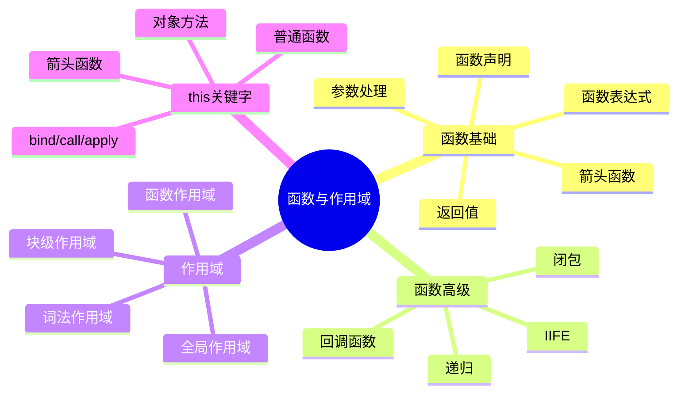

# 函数基础与作用域

## 为什么需要函数？

想象一下，如果你需要多次执行同样的代码，比如计算多个数的平均值。如果没有函数，你可能需要重复写很多次相同的代码：

```javascript
// 不使用函数的情况
let sum1 = numbers1[0] + numbers1[1] + numbers1[2];
let average1 = sum1 / 3;

let sum2 = numbers2[0] + numbers2[1] + numbers2[2];
let average2 = sum2 / 3;

// 这样很繁琐，而且容易出错
```

有了函数，我们可以把这些重复的代码打包成一个可重用的模块：

```javascript
function calculateAverage(numbers) {
    let sum = 0;
    for(let number of numbers) {
        sum += number;
    }
    return sum / numbers.length;
}

// 现在我们可以轻松计算任意数组的平均值
let average1 = calculateAverage([1, 2, 3]);     // 2
let average2 = calculateAverage([4, 5, 6, 7]);  // 5.5
```

## 函数的三种定义方式

在JavaScript中，我们有三种主要的方式来创建函数，每种方式都有其特定的使用场景。

### 1. 函数声明 - 最基础的方式

```javascript
function sayHello(name) {
    console.log(`你好，${name}！`);
}
```

这种方式的特点是：
- 函数会被提升（hoisted），这意味着你可以在声明之前使用它
- 代码清晰直观，一眼就能看出这是一个函数
- 适合定义那些在整个程序中都需要使用的基础函数

实际应用场景：
```javascript
// 即使在声明前调用也没问题
sayHello("小明");  // 输出："你好，小明！"

function sayHello(name) {
    console.log(`你好，${name}！`);
}

// 常用于工具函数
function formatDate(date) {
    return `${date.getFullYear()}-${date.getMonth() + 1}-${date.getDate()}`;
}
```

### 2. 函数表达式 - 灵活的函数定义方式

```javascript
const calculateArea = function(width, height) {
    return width * height;
};
```

这种方式的特点：
- 函数不会被提升，必须先定义后使用
- 可以将函数赋值给变量或作为参数传递
- 适合需要动态创建或者作为值传递的函数

实际应用场景：
```javascript
// 作为回调函数使用
const numbers = [1, 2, 3, 4, 5];
const doubled = numbers.map(function(num) {
    return num * 2;
});
console.log(doubled);  // [2, 4, 6, 8, 10]

// 根据条件选择不同的函数
const operations = {
    add: function(a, b) { return a + b; },
    subtract: function(a, b) { return a - b; }
};
const result = operations.add(5, 3);  // 8
```

### 3. 箭头函数 - 现代JavaScript的简洁写法

```javascript
const greet = (name) => `你好，${name}！`;
```

这种方式的特点：
- 更简洁的语法
- 没有自己的this，继承外层作用域的this
- 特别适合用作回调函数

实际应用场景：
```javascript
// 1. 简单的数组处理
const prices = [100, 200, 300];
const withTax = prices.map(price => price * 1.2);
console.log(withTax);  // [120, 240, 360]

// 2. 事件处理
button.addEventListener('click', () => {
    console.log('按钮被点击了！');
});

// 3. Promise链式调用
fetch('https://api.example.com/data')
    .then(response => response.json())
    .then(data => console.log(data))
    .catch(error => console.error('出错了：', error));
```

## 函数参数的高级用法

### 1. 默认参数 - 让函数更灵活

```javascript
function createUser(name = '访客', age = 18, role = '普通用户') {
    return {
        name,
        age,
        role
    };
}
```

这个特性的实际应用：
```javascript
// 只传必要参数，其他使用默认值
const guest = createUser();  
console.log(guest);  // { name: '访客', age: 18, role: '普通用户' }

// 部分使用默认值
const user = createUser('张三');  
console.log(user);  // { name: '张三', age: 18, role: '普通用户' }

// API请求中的配置对象
function fetchData(url, options = { method: 'GET', headers: {} }) {
    // 使用默认配置进行请求
    return fetch(url, options);
}
```

### 2. 剩余参数 - 处理不定数量的参数

```javascript
function sum(...numbers) {
    return numbers.reduce((total, num) => total + num, 0);
}
```

这个特性特别有用的场景：
```javascript
// 1. 计算任意数量的数字之和
console.log(sum(1, 2));          // 3
console.log(sum(1, 2, 3, 4));    // 10

// 2. 创建日志函数
function log(level, ...messages) {
    const time = new Date().toISOString();
    console.log(`[${time}] [${level}]:`, ...messages);
}

log('INFO', '用户登录成功', '用户ID:', 123);
// 输出：[2024-01-20T10:30:00.000Z] [INFO]: 用户登录成功 用户ID: 123

// 3. 合并数组和对象
function mergeObjects(base, ...objects) {
    return Object.assign(base, ...objects);
}

const result = mergeObjects(
    { name: '张三' },
    { age: 25 },
    { city: '北京' }
);
console.log(result);  // { name: '张三', age: 25, city: '北京' }
```

## 闭包 - 函数的记忆能力

闭包是JavaScript中最强大的特性之一，它允许函数记住并访问其外部作用域的变量。

### 实际应用示例：

1. 创建私有变量：
```javascript
function createCounter() {
    let count = 0;  // 这个变量外部无法直接访问
    
    return {
        increment() {
            count++;
            return count;
        },
        decrement() {
            count--;
            return count;
        },
        getCount() {
            return count;
        }
    };
}

const counter = createCounter();
console.log(counter.increment());  // 1
console.log(counter.increment());  // 2
console.log(counter.decrement());  // 1
console.log(counter.getCount());   // 1
// 无法直接访问count变量
```

2. 实现防抖函数：
```javascript
function debounce(fn, delay) {
    let timer = null;
    
    return function(...args) {
        // 清除之前的定时器
        if (timer) clearTimeout(timer);
        
        // 设置新的定时器
        timer = setTimeout(() => {
            fn.apply(this, args);
        }, delay);
    };
}

// 实际应用：处理搜索输入
const searchInput = document.querySelector('#search');
const handleSearch = debounce((event) => {
    // 执行搜索操作
    console.log('搜索:', event.target.value);
}, 500);

searchInput.addEventListener('input', handleSearch);
```

3. 创建缓存函数（记忆化）：
```javascript
function createCache() {
    const cache = new Map();
    
    return function(key, computer) {
        if (cache.has(key)) {
            console.log('从缓存中获取');
            return cache.get(key);
        }
        
        const result = computer();
        cache.set(key, result);
        return result;
    };
}

// 使用缓存存储计算结果
const cache = createCache();
const result1 = cache('key1', () => {
    console.log('执行复杂计算');
    return 42;
});  // 输出：执行复杂计算

const result2 = cache('key1', () => {
    console.log('执行复杂计算');
    return 42;
});  // 输出：从缓存中获取
```

## this关键字 - 函数的上下文

`this` 是JavaScript中最容易混淆的概念之一，它的值取决于函数的调用方式。

### 1. 普通函数中的this

```javascript
const user = {
    name: '张三',
    greet() {
        console.log(`你好，我是${this.name}`);
    },
    friendList: ['李四', '王五'],
    greetFriends() {
        // 这里的this会丢失
        this.friendList.forEach(function(friend) {
            console.log(`${this.name}向${friend}问好`);  // this.name 是 undefined
        });
    }
};

user.greet();  // 正常工作：输出 "你好，我是张三"
user.greetFriends();  // 出错：this.name 是 undefined
```

### 2. 箭头函数中的this

箭头函数没有自己的this，它会继承外层作用域的this：

```javascript
const user = {
    name: '张三',
    friendList: ['李四', '王五'],
    greetFriends() {
        // 使用箭头函数，this正确指向user
        this.friendList.forEach(friend => {
            console.log(`${this.name}向${friend}问好`);
        });
    }
};

user.greetFriends();
// 输出：
// 张三向李四问好
// 张三向王五问好
```

### 3. 显式绑定this

有时我们需要明确指定函数的this指向：

```javascript
function introduce() {
    console.log(`我是${this.name}，今年${this.age}岁`);
}

const person1 = { name: '张三', age: 25 };
const person2 = { name: '李四', age: 30 };

// 使用call
introduce.call(person1);  // 输出：我是张三，今年25岁

// 使用bind创建新函数
const introducePerson2 = introduce.bind(person2);
introducePerson2();  // 输出：我是李四，今年30岁

// 实际应用：事件处理器中保持this指向
class TodoList {
    constructor() {
        this.todos = [];
        // 使用bind确保handleClick中的this指向TodoList实例
        this.handleClick = this.handleClick.bind(this);
    }
    
    handleClick() {
        this.todos.push('新任务');
        console.log(this.todos);
    }
}
```

## 最佳实践与常见陷阱

### 1. 避免this丢失

```javascript
// 错误示例
class Timer {
    constructor() {
        this.seconds = 0;
        setInterval(function() {
            this.seconds++;  // this指向错误
        }, 1000);
    }
}

// 正确示例
class Timer {
    constructor() {
        this.seconds = 0;
        setInterval(() => {
            this.seconds++;  // 使用箭头函数，this正确指向Timer实例
        }, 1000);
    }
}
```

### 2. 合理使用闭包，避免内存泄漏

```javascript
// 错误示例：可能造成内存泄漏
function createButtons() {
    let buttons = [];
    for(let i = 0; i < 10; i++) {
        let button = document.createElement('button');
        button.innerText = `Button ${i}`;
        buttons.push(button);
    }
    // buttons数组一直被持有，即使不再需要
    return function() {
        return buttons;
    };
}

// 正确示例：及时清理不需要的引用
function createButtons() {
    const buttons = [];
    for(let i = 0; i < 10; i++) {
        let button = document.createElement('button');
        button.innerText = `Button ${i}`;
        buttons.push(button);
    }
    // 返回后清理引用
    const result = buttons.slice();
    buttons.length = 0;
    return result;
}
```

### 3. 函数参数的设计

```javascript
// 不好的设计：参数过多
function createUser(name, age, city, country, occupation, hobby) {
    // ...
}

// 好的设计：使用配置对象
function createUser({
    name,
    age,
    city = '未知',
    country = '中国',
    occupation = '未知',
    hobby = []
} = {}) {
    return {
        name,
        age,
        city,
        country,
        occupation,
        hobby
    };
}

// 使用时更清晰
const user = createUser({
    name: '张三',
    age: 25,
    occupation: '程序员'
});
```

## 练习题与实战

1. 实现一个防抖函数，并用它优化搜索输入：

```javascript
function debounce(fn, delay) {
    let timer = null;
    return function(...args) {
        if (timer) clearTimeout(timer);
        timer = setTimeout(() => {
            fn.apply(this, args);
        }, delay);
    };
}

// 测试代码
const searchInput = document.querySelector('#search');
const handleSearch = debounce((event) => {
    console.log('搜索:', event.target.value);
}, 500);

searchInput.addEventListener('input', handleSearch);
```

2. 实现一个简单的计算器，练习闭包和函数组合：

```javascript
function createCalculator() {
    let result = 0;
    
    return {
        add(n) {
            result += n;
            return this;
        },
        subtract(n) {
            result -= n;
            return this;
        },
        multiply(n) {
            result *= n;
            return this;
        },
        divide(n) {
            if (n === 0) throw new Error('不能除以0');
            result /= n;
            return this;
        },
        getResult() {
            return result;
        },
        reset() {
            result = 0;
            return this;
        }
    };
}

// 使用示例
const calc = createCalculator();
console.log(
    calc.add(5)
        .multiply(2)
        .subtract(3)
        .divide(2)
        .getResult()  // 输出：3.5
);
```

3. 实现一个简单的事件发布订阅系统：

```javascript
function createEventEmitter() {
    const events = new Map();
    
    return {
        on(event, callback) {
            if (!events.has(event)) {
                events.set(event, []);
            }
            events.get(event).push(callback);
        },
        
        off(event, callback) {
            if (!events.has(event)) return;
            const callbacks = events.get(event);
            const index = callbacks.indexOf(callback);
            if (index !== -1) {
                callbacks.splice(index, 1);
            }
        },
        
        emit(event, ...args) {
            if (!events.has(event)) return;
            events.get(event).forEach(callback => {
                callback(...args);
            });
        }
    };
}

// 使用示例
const emitter = createEventEmitter();

function handleUserLogin(user) {
    console.log(`用户 ${user} 登录了`);
}

emitter.on('login', handleUserLogin);
emitter.emit('login', '张三');  // 输出：用户 张三 登录了
emitter.off('login', handleUserLogin);
emitter.emit('login', '李四');  // 没有输出
```

## 知识导图


## 相关链接
- [[流程控制与循环结构]]
- [[对象基础与原型链]]
- [[ES6+特性详解]]

## 练习题
1. 实现一个防抖函数
2. 使用闭包创建私有变量
3. 实现函数柯里化
4. 处理回调地狱问题 

## 实战练习

1. 实现一个函数式编程工具库：

```javascript
class FP {
    // 柯里化函数
    static curry(fn) {
        return function curried(...args) {
            if (args.length >= fn.length) {
                return fn.apply(this, args);
            }
            return function(...moreArgs) {
                return curried.apply(this, args.concat(moreArgs));
            };
        };
    }
    
    // 函数组合
    static compose(...fns) {
        return function(x) {
            return fns.reduceRight((value, fn) => fn(value), x);
        };
    }
    
    // 函数管道
    static pipe(...fns) {
        return function(x) {
            return fns.reduce((value, fn) => fn(value), x);
        };
    }
    
    // 偏函数应用
    static partial(fn, ...args) {
        return function(...moreArgs) {
            return fn.apply(this, [...args, ...moreArgs]);
        };
    }
    
    // 记忆化函数
    static memoize(fn, keyGenerator) {
        const cache = new Map();
        
        return function(...args) {
            const key = keyGenerator ? keyGenerator(...args) : JSON.stringify(args);
            
            if (cache.has(key)) {
                return cache.get(key);
            }
            
            const result = fn.apply(this, args);
            cache.set(key, result);
            return result;
        };
    }
}

// 使用示例

// 1. 柯里化
const add = (a, b, c) => a + b + c;
const curriedAdd = FP.curry(add);
console.log(curriedAdd(1)(2)(3));  // 6
console.log(curriedAdd(1, 2)(3));  // 6
console.log(curriedAdd(1)(2, 3));  // 6

// 2. 函数组合
const addOne = x => x + 1;
const double = x => x * 2;
const square = x => x * x;

const composed = FP.compose(square, double, addOne);
console.log(composed(3));  // ((3 + 1) * 2)² = 64

// 3. 函数管道
const piped = FP.pipe(addOne, double, square);
console.log(piped(3));  // (((3 + 1) * 2)² = 64

// 4. 偏函数应用
const multiply = (a, b, c) => a * b * c;
const multiplyByTwo = FP.partial(multiply, 2);
console.log(multiplyByTwo(3, 4));  // 24

// 5. 记忆化函数
const fibonacci = FP.memoize((n) => {
    if (n <= 1) return n;
    return fibonacci(n - 1) + fibonacci(n - 2);
});

console.log(fibonacci(10));  // 快速计算，使用缓存

2. 实现一个装饰器工具库：

```javascript
class Decorators {
    // 函数执行时间装饰器
    static measureTime(fn) {
        return function(...args) {
            const start = performance.now();
            const result = fn.apply(this, args);
            const end = performance.now();
            console.log(`函数 ${fn.name} 执行时间: ${end - start}ms`);
            return result;
        };
    }
    
    // 重试装饰器
    static retry(fn, maxAttempts = 3, delay = 1000) {
        return async function(...args) {
            let lastError;
            
            for (let attempt = 1; attempt <= maxAttempts; attempt++) {
                try {
                    return await fn.apply(this, args);
                } catch (error) {
                    lastError = error;
                    console.log(`尝试 ${attempt}/${maxAttempts} 失败:`, error.message);
                    
                    if (attempt < maxAttempts) {
                        await new Promise(resolve => setTimeout(resolve, delay));
                    }
                }
            }
            
            throw lastError;
        };
    }
    
    // 缓存装饰器
    static cache(fn, ttl = 5000) {
        const cache = new Map();
        
        return function(...args) {
            const key = JSON.stringify(args);
            const cached = cache.get(key);
            
            if (cached && Date.now() - cached.timestamp < ttl) {
                return cached.value;
            }
            
            const result = fn.apply(this, args);
            cache.set(key, {
                value: result,
                timestamp: Date.now()
            });
            
            return result;
        };
    }
    
    // 节流装饰器
    static throttle(fn, limit = 1000) {
        let inThrottle;
        
        return function(...args) {
            if (!inThrottle) {
                fn.apply(this, args);
                inThrottle = true;
                setTimeout(() => inThrottle = false, limit);
            }
        };
    }
    
    // 防抖装饰器
    static debounce(fn, delay = 1000) {
        let timeoutId;
        
        return function(...args) {
            clearTimeout(timeoutId);
            timeoutId = setTimeout(() => fn.apply(this, args), delay);
        };
    }
}

// 使用示例

// 1. 测量执行时间
const slowFunction = Decorators.measureTime(function slow() {
    let sum = 0;
    for (let i = 0; i < 1000000; i++) {
        sum += i;
    }
    return sum;
});

slowFunction();  // 输出执行时间

// 2. 自动重试
const fetchData = Decorators.retry(async function fetch() {
    const response = await axios.get('https://api.example.com/data');
    return response.data;
});

// 3. 缓存结果
const expensiveCalculation = Decorators.cache(function calculate(n) {
    console.log('执行计算...');
    return n * n;
});

console.log(expensiveCalculation(5));  // 执行计算
console.log(expensiveCalculation(5));  // 使用缓存

// 4. 节流处理
const handleScroll = Decorators.throttle(function onScroll(event) {
    console.log('处理滚动事件');
});

window.addEventListener('scroll', handleScroll);

// 5. 防抖处理
const handleSearch = Decorators.debounce(function search(query) {
    console.log('搜索:', query);
});

searchInput.addEventListener('input', e => handleSearch(e.target.value));

3. 实现一个函数组合器：

```javascript
class FunctionComposer {
    constructor(initialValue) {
        this.value = initialValue;
        this.operations = [];
    }
    
    // 映射操作
    map(fn) {
        this.operations.push(value => 
            Array.isArray(value) ? value.map(fn) : fn(value)
        );
        return this;
    }
    
    // 过滤操作
    filter(predicate) {
        this.operations.push(value =>
            Array.isArray(value) ? value.filter(predicate) : 
            (predicate(value) ? value : undefined)
        );
        return this;
    }
    
    // 归约操作
    reduce(fn, initial) {
        this.operations.push(value =>
            Array.isArray(value) ? value.reduce(fn, initial) : value
        );
        return this;
    }
    
    // 分组操作
    groupBy(keySelector) {
        this.operations.push(value => {
            if (!Array.isArray(value)) return value;
            
            return value.reduce((groups, item) => {
                const key = keySelector(item);
                (groups[key] = groups[key] || []).push(item);
                return groups;
            }, {});
        });
        return this;
    }
    
    // 排序操作
    sort(comparator) {
        this.operations.push(value =>
            Array.isArray(value) ? [...value].sort(comparator) : value
        );
        return this;
    }
    
    // 去重操作
    distinct(keySelector = x => x) {
        this.operations.push(value => {
            if (!Array.isArray(value)) return value;
            
            const seen = new Set();
            return value.filter(item => {
                const key = keySelector(item);
                if (seen.has(key)) return false;
                seen.add(key);
                return true;
            });
        });
        return this;
    }
    
    // 限制结果数量
    take(n) {
        this.operations.push(value =>
            Array.isArray(value) ? value.slice(0, n) : value
        );
        return this;
    }
    
    // 执行所有操作
    execute() {
        return this.operations.reduce(
            (value, operation) => operation(value),
            this.value
        );
    }
}

// 使用示例
const data = [
    { id: 1, name: '张三', age: 25, city: '北京' },
    { id: 2, name: '李四', age: 30, city: '上海' },
    { id: 3, name: '王五', age: 28, city: '北京' },
    { id: 4, name: '赵六', age: 35, city: '上海' }
];

const result = new FunctionComposer(data)
    .filter(user => user.age >= 25)
    .map(user => ({
        ...user,
        displayName: `${user.name} (${user.age}岁)`
    }))
    .groupBy(user => user.city)
    .execute();

console.log(result);
/*
{
    '北京': [
        { id: 1, name: '张三', age: 25, city: '北京', displayName: '张三 (25岁)' },
        { id: 3, name: '王五', age: 28, city: '北京', displayName: '王五 (28岁)' }
    ],
    '上海': [
        { id: 2, name: '李四', age: 30, city: '上海', displayName: '李四 (30岁)' },
        { id: 4, name: '赵六', age: 35, city: '上海', displayName: '赵六 (35岁)' }
    ]
}
*/
```

这些实战练习展示了如何在实际项目中运用函数和闭包：

1. 函数式编程工具库（FP）
   - 实现了常用的函数式编程工具
   - 包括柯里化、组合、管道等
   - 提供了记忆化功能
   - 支持偏函数应用

2. 装饰器工具库（Decorators）
   - 提供了性能监控装饰器
   - 实现了自动重试机制
   - 包含缓存功能
   - 支持节流和防抖处理

3. 函数组合器（FunctionComposer）
   - 支持链式调用
   - 提供了丰富的数据处理操作
   - 实现了惰性求值
   - 包含常用的集合操作

通过这些示例，你可以学习到：

1. 如何使用闭包实现高阶函数
2. 如何设计可组合的函数
3. 如何实现函数装饰器
4. 如何处理异步操作
5. 如何优化函数性能 