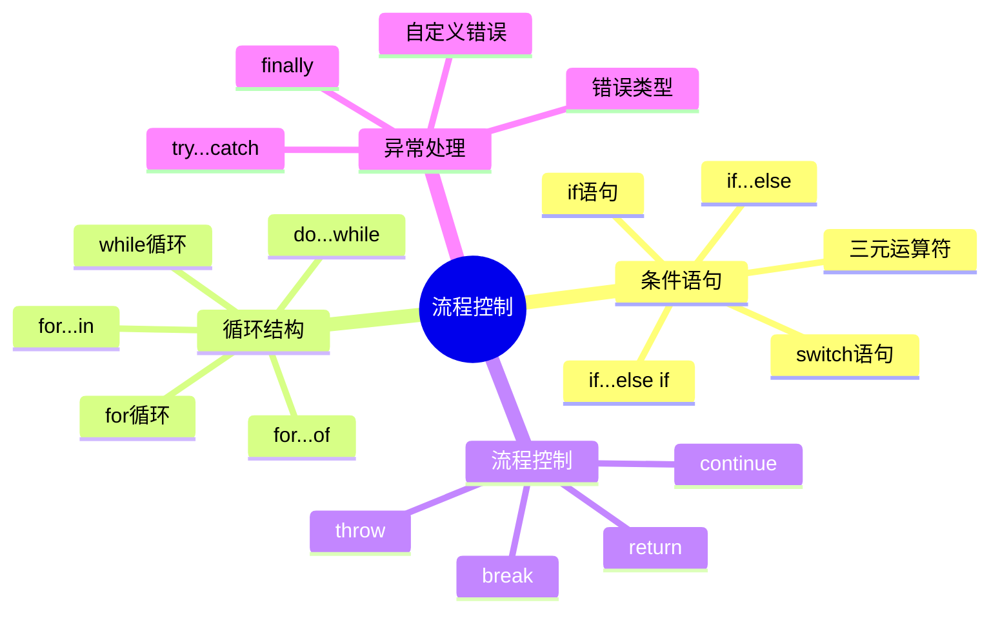

# 流程控制与循环结构

## 为什么需要流程控制？

想象你正在开发一个游戏，玩家需要根据分数获得不同的评级：

```javascript
// 不使用流程控制的情况
console.log("玩家分数：" + score);
console.log("评级：S");  // 但这个评级是固定的，无法根据分数变化
```

有了流程控制，我们可以根据不同的情况做出不同的响应：

```javascript
let score = 85;

if (score >= 90) {
    console.log("评级：S");
} else if (score >= 80) {
    console.log("评级：A");
} else if (score >= 70) {
    console.log("评级：B");
} else {
    console.log("评级：C");
}
```

## 知识导图


## 条件语句

### if语句
最基本的条件语句，用于在条件为真时执行代码块：

```javascript
let score = 85;

if (score >= 60) {
    console.log("及格了！");
}
```

### if...else语句
在条件为真或假时执行不同的代码块：

```javascript
let age = 16;

if (age >= 18) {
    console.log("成年人");
} else {
    console.log("未成年人");
}
```

### if...else if语句
处理多个条件的情况：

```javascript
let score = 85;

if (score >= 90) {
    console.log("优秀");
} else if (score >= 80) {
    console.log("良好");
} else if (score >= 60) {
    console.log("及格");
} else {
    console.log("不及格");
}
```

### switch语句
用于多条件分支判断：

```javascript
let day = new Date().getDay();

switch (day) {
    case 0:
        console.log("星期日");
        break;
    case 1:
        console.log("星期一");
        break;
    case 2:
        console.log("星期二");
        break;
    default:
        console.log("其他日期");
}
```

### 三元运算符
简洁的条件判断方式：

```javascript
let age = 20;
let status = age >= 18 ? "成年" : "未成年";
```

## 循环结构

### for循环
最常用的循环结构：

```javascript
// 基本for循环
for (let i = 0; i < 5; i++) {
    console.log(i);
}

// 遍历数组
let fruits = ["苹果", "香蕉", "橙子"];
for (let i = 0; i < fruits.length; i++) {
    console.log(fruits[i]);
}
```

### while循环
当条件为真时持续执行：

```javascript
let count = 0;
while (count < 5) {
    console.log(count);
    count++;
}
```

### do...while循环
至少执行一次的循环：

```javascript
let num = 0;
do {
    console.log(num);
    num++;
} while (num < 5);
```

### for...in循环
用于遍历对象的属性：

```javascript
let person = {
    name: "张三",
    age: 25,
    city: "北京"
};

for (let key in person) {
    console.log(`${key}: ${person[key]}`);
}
```

### for...of循环
用于遍历可迭代对象：

```javascript
let colors = ["红", "绿", "蓝"];

for (let color of colors) {
    console.log(color);
}
```

## 流程控制语句

### break语句
跳出循环：

```javascript
for (let i = 0; i < 10; i++) {
    if (i === 5) {
        break;
    }
    console.log(i);
}
```

### continue语句
跳过当前循环：

```javascript
for (let i = 0; i < 5; i++) {
    if (i === 2) {
        continue;
    }
    console.log(i);
}
```

### return语句
结束函数执行：

```javascript
function checkAge(age) {
    if (age < 0) {
        return "年龄不能为负数";
    }
    return "年龄合法";
}
```

## 异常处理

### try...catch
捕获和处理错误：

```javascript
try {
    // 可能出错的代码
    let result = someUndefinedVariable + 1;
} catch (error) {
    console.error("发生错误：", error.message);
}
```

### try...catch...finally
无论是否发生错误都会执行的代码：

```javascript
try {
    console.log("尝试执行");
    throw new Error("发生错误");
} catch (error) {
    console.error("捕获错误：", error.message);
} finally {
    console.log("总是执行");
}
```

### 自定义错误
创建自定义错误类型：

```javascript
class ValidationError extends Error {
    constructor(message) {
        super(message);
        this.name = "ValidationError";
    }
}

try {
    throw new ValidationError("输入数据无效");
} catch (error) {
    console.error(error.name + ": " + error.message);
}
```

## 最佳实践

1. 条件语句
   - 使用严格相等(===)进行比较
   - 优先使用三元运算符处理简单条件
   - switch语句记得使用break

2. 循环结构
   - 选择合适的循环方式
   - 注意循环终止条件
   - 避免无限循环

3. 异常处理
   - 只捕获可处理的错误
   - 提供有意义的错误信息
   - 合理使用finally块

## 常见问题

1. 循环性能
   - 大数据量时的循环选择
   - 循环中的内存管理
   - 避免不必要的循环嵌套

2. 错误处理
   - 同步vs异步错误处理
   - 错误传播机制
   - 错误恢复策略

## 相关链接
- [[变量、数据类型与运算符]]
- [[函数基础与作用域]]
- [[JavaScript编程实践]]

## 练习题
1. 实现一个简单的计算器程序，支持基本运算
2. 编写程序找出100以内的所有质数
3. 实现数组去重功能
4. 创建一个错误处理系统，处理不同类型的错误

## 实战练习

1. 实现一个有限状态机：

```javascript
class StateMachine {
    constructor(config) {
        this.states = new Map();
        this.currentState = null;
        this.initialState = null;
        
        // 初始化状态配置
        for (const [stateName, stateConfig] of Object.entries(config)) {
            this.addState(stateName, stateConfig);
            if (stateConfig.initial) {
                this.initialState = stateName;
            }
        }
        
        // 设置初始状态
        if (this.initialState) {
            this.transition(this.initialState);
        }
    }
    
    addState(stateName, config) {
        this.states.set(stateName, {
            actions: config.actions || {},
            transitions: config.transitions || {},
            onEnter: config.onEnter || (() => {}),
            onExit: config.onExit || (() => {})
        });
    }
    
    transition(newState, ...args) {
        const currentState = this.states.get(this.currentState);
        const nextState = this.states.get(newState);
        
        if (!nextState) {
            throw new Error(`状态 ${newState} 不存在`);
        }
        
        if (currentState) {
            // 检查是否允许转换到新状态
            if (!currentState.transitions[newState]) {
                throw new Error(`不允许从 ${this.currentState} 转换到 ${newState}`);
            }
            // 执行退出动作
            currentState.onExit(this.currentState, newState, ...args);
        }
        
        // 更新当前状态
        this.currentState = newState;
        
        // 执行进入动作
        nextState.onEnter(this.currentState, ...args);
        
        return this;
    }
    
    action(actionName, ...args) {
        const state = this.states.get(this.currentState);
        if (!state) {
            throw new Error('没有当前状态');
        }
        
        const action = state.actions[actionName];
        if (!action) {
            throw new Error(`动作 ${actionName} 在当前状态 ${this.currentState} 下不可用`);
        }
        
        return action.call(this, ...args);
    }
}

// 使用示例：订单状态管理
const orderStateMachine = new StateMachine({
    pending: {
        initial: true,
        actions: {
            cancel: function() {
                this.transition('cancelled');
            },
            pay: function() {
                this.transition('paid');
            }
        },
        transitions: {
            cancelled: true,
            paid: true
        },
        onEnter: () => console.log('订单已创建，等待支付')
    },
    paid: {
        actions: {
            ship: function() {
                this.transition('shipped');
            },
            refund: function() {
                this.transition('refunded');
            }
        },
        transitions: {
            shipped: true,
            refunded: true
        },
        onEnter: () => console.log('订单已支付，等待发货')
    },
    shipped: {
        actions: {
            deliver: function() {
                this.transition('delivered');
            }
        },
        transitions: {
            delivered: true
        },
        onEnter: () => console.log('订单已发货，等待送达')
    },
    delivered: {
        onEnter: () => console.log('订单已送达')
    },
    cancelled: {
        onEnter: () => console.log('订单已取消')
    },
    refunded: {
        onEnter: () => console.log('订单已退款')
    }
});

// 使用状态机处理订单流程
orderStateMachine.action('pay');     // 支付订单
orderStateMachine.action('ship');    // 发货
orderStateMachine.action('deliver'); // 送达

2. 实现一个表单验证器：

```javascript
class FormValidator {
    constructor(rules) {
        this.rules = rules;
        this.errors = new Map();
    }
    
    // 内置验证规则
    static validators = {
        required: (value) => {
            return value !== null && value !== undefined && value.toString().trim() !== '';
        },
        
        minLength: (value, min) => {
            return value.length >= min;
        },
        
        maxLength: (value, max) => {
            return value.length <= max;
        },
        
        email: (value) => {
            return /^[^\s@]+@[^\s@]+\.[^\s@]+$/.test(value);
        },
        
        phone: (value) => {
            return /^1[3-9]\d{9}$/.test(value);
        },
        
        number: (value) => {
            return !isNaN(value) && isFinite(value);
        },
        
        min: (value, min) => {
            return Number(value) >= min;
        },
        
        max: (value, max) => {
            return Number(value) <= max;
        },
        
        pattern: (value, pattern) => {
            return pattern.test(value);
        }
    };
    
    // 验证单个字段
    validateField(field, value) {
        const fieldRules = this.rules[field];
        if (!fieldRules) return true;
        
        this.errors.delete(field);
        
        for (const [rule, config] of Object.entries(fieldRules)) {
            const validator = FormValidator.validators[rule];
            if (!validator) continue;
            
            const isValid = validator(value, config.value);
            if (!isValid) {
                this.errors.set(field, config.message);
                return false;
            }
        }
        
        return true;
    }
    
    // 验证所有字段
    validate(data) {
        this.errors.clear();
        
        for (const [field, value] of Object.entries(data)) {
            this.validateField(field, value);
        }
        
        return {
            isValid: this.errors.size === 0,
            errors: Object.fromEntries(this.errors)
        };
    }
}

// 使用示例：注册表单验证
const registerValidator = new FormValidator({
    username: {
        required: {
            value: true,
            message: '用户名不能为空'
        },
        minLength: {
            value: 3,
            message: '用户名至少3个字符'
        },
        maxLength: {
            value: 20,
            message: '用户名最多20个字符'
        }
    },
    email: {
        required: {
            value: true,
            message: '邮箱不能为空'
        },
        email: {
            value: true,
            message: '邮箱格式不正确'
        }
    },
    phone: {
        required: {
            value: true,
            message: '手机号不能为空'
        },
        phone: {
            value: true,
            message: '手机号格式不正确'
        }
    },
    age: {
        number: {
            value: true,
            message: '年龄必须是数字'
        },
        min: {
            value: 18,
            message: '年龄必须大于等于18岁'
        },
        max: {
            value: 100,
            message: '年龄必须小于等于100岁'
        }
    }
});

// 验证表单数据
const formData = {
    username: 'zh',
    email: 'invalid-email',
    phone: '12345',
    age: '15'
};

const result = registerValidator.validate(formData);
console.log(result);
/*
{
    isValid: false,
    errors: {
        username: '用户名至少3个字符',
        email: '邮箱格式不正确',
        phone: '手机号格式不正确',
        age: '年龄必须大于等于18岁'
    }
}
*/

3. 实现一个任务调度器：

```javascript
class TaskScheduler {
    constructor() {
        this.tasks = new Map();
        this.running = false;
    }
    
    // 添加任务
    addTask(name, interval, callback) {
        if (this.tasks.has(name)) {
            throw new Error(`任务 ${name} 已存在`);
        }
        
        const task = {
            name,
            interval,
            callback,
            lastRun: 0,
            timerId: null
        };
        
        this.tasks.set(name, task);
        
        if (this.running) {
            this.startTask(task);
        }
        
        return this;
    }
    
    // 移除任务
    removeTask(name) {
        const task = this.tasks.get(name);
        if (task) {
            if (task.timerId) {
                clearTimeout(task.timerId);
            }
            this.tasks.delete(name);
        }
        return this;
    }
    
    // 启动任务
    startTask(task) {
        const now = Date.now();
        const delay = Math.max(0, task.interval - (now - task.lastRun));
        
        task.timerId = setTimeout(() => {
            task.callback();
            task.lastRun = Date.now();
            if (this.running) {
                this.startTask(task);
            }
        }, delay);
    }
    
    // 启动调度器
    start() {
        if (this.running) return this;
        
        this.running = true;
        for (const task of this.tasks.values()) {
            this.startTask(task);
        }
        
        return this;
    }
    
    // 停止调度器
    stop() {
        if (!this.running) return this;
        
        this.running = false;
        for (const task of this.tasks.values()) {
            if (task.timerId) {
                clearTimeout(task.timerId);
                task.timerId = null;
            }
        }
        
        return this;
    }
    
    // 立即执行任务
    runTask(name) {
        const task = this.tasks.get(name);
        if (task) {
            task.callback();
            task.lastRun = Date.now();
            
            if (this.running && task.timerId) {
                clearTimeout(task.timerId);
                this.startTask(task);
            }
        }
        return this;
    }
}

// 使用示例：定时任务管理
const scheduler = new TaskScheduler();

// 添加任务
scheduler.addTask('checkEmail', 5000, () => {
    console.log('检查新邮件...');
});

scheduler.addTask('backup', 10000, () => {
    console.log('执行数据备份...');
});

scheduler.addTask('cleanup', 7000, () => {
    console.log('清理临时文件...');
});

// 启动调度器
scheduler.start();

// 5秒后停止调度器
setTimeout(() => {
    scheduler.stop();
    console.log('调度器已停止');
}, 5000);
```

这些实战练习展示了如何在实际项目中运用流程控制和循环结构：

1. 状态机（StateMachine）
   - 实现了完整的状态转换管理
   - 支持状态进入/退出钩子
   - 支持状态特定的动作
   - 提供了订单流程管理的实例

2. 表单验证器（FormValidator）
   - 支持多种验证规则
   - 可扩展的验证器系统
   - 详细的错误信息管理
   - 支持单字段和整表单验证

3. 任务调度器（TaskScheduler）
   - 支持定时任务管理
   - 可动态添加/移除任务
   - 精确的时间控制
   - 支持任务的暂停和恢复

通过这些示例，你可以学习到：

1. 如何使用条件语句实现复杂的状态管理
2. 如何使用循环结构处理异步任务
3. 如何实现可扩展的验证系统
4. 如何管理定时任务和调度
5. 如何处理错误和异常情况 