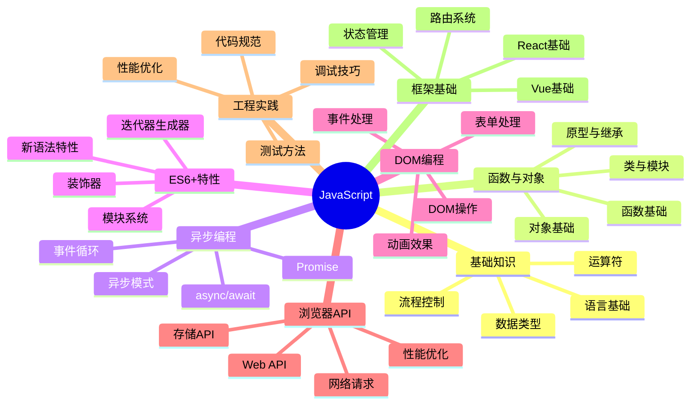

# JavaScript完全教程

## 知识导图

## 课程目录

### 第一部分：JavaScript基础
1. [[JavaScript简介与环境搭建]]
2. [[变量、数据类型与运算符]]
3. [[流程控制与循环结构]]
4. [[函数基础与作用域]]

### 第二部分：面向对象编程
1. [[对象基础与原型链]]
2. [[类与继承]]
3. [[模块化编程]]
4. [[设计模式基础]]

### 第三部分：异步编程
1. [[Promise详解]]
2. [[async与await]]
3. [[事件循环机制]]
4. [[异步编程模式]]

### 第四部分：ES6+新特性
1. [[ES6核心特性]]
2. [[ES7到ES13新特性]]
3. [[现代JavaScript语法]]
4. [[装饰器与元编程]]

### 第五部分：DOM编程
1. [[DOM操作基础]]
2. [[事件处理系统]]
3. [[表单处理与验证]]
4. [[动画与过渡效果]]

### 第六部分：浏览器API
1. [[存储API详解]]
2. [[网络请求与Fetch]]
3. [[Web API精选]]
4. [[浏览器渲染原理]]

### 第七部分：工程实践
1. [[代码规范与最佳实践]]
2. [[单元测试与集成测试]]
3. [[调试与性能优化]]
4. [[安全性考虑]]

### 第八部分：现代框架基础
1. [[React基础概念]]
2. [[Vue基础概念]]
3. [[状态管理详解]]
4. [[前端路由实现]]

## 学习路径建议

### 入门阶段（1-2周）
- 完成第一部分的全部内容
- 掌握基本语法和概念
- 完成简单的编程练习

### 进阶阶段（2-4周）
- 学习第二、三部分内容
- 理解面向对象和异步编程
- 开始小型项目实践

### 深入阶段（4-8周）
- 学习第四、五部分内容
- 掌握现代JavaScript特性
- 进行综合项目开发

### 实战阶段（8-12周）
- 学习第六、七、八部分内容
- 参与实际项目开发
- 掌握框架使用

## 学习建议
1. 循序渐进：按照教程顺序学习，不要跳跃
2. 动手实践：每个概念都要亲自编写代码验证
3. 项目驱动：结合实际项目来应用所学知识
4. 查阅文档：养成阅读官方文档的习惯
5. 社区参与：关注技术社区，与他人交流学习

## 推荐资源
- MDN Web文档
- JavaScript.info
- ECMAScript规范文档
- GitHub优秀项目
- 技术博客和论坛

## 进阶路线
1. 深入学习框架源码
2. 研究编译原理
3. 探索性能优化
4. 参与开源项目
5. 研究新技术方向 