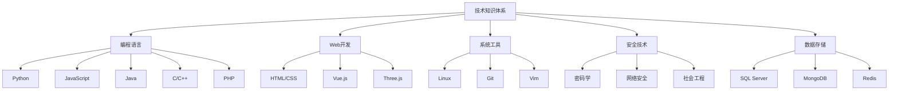
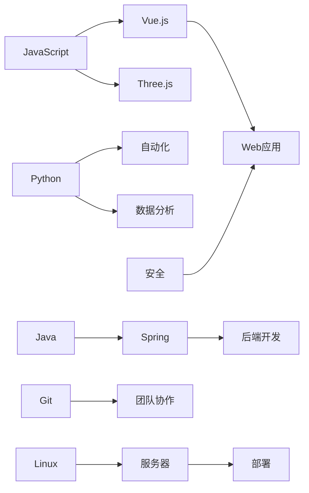
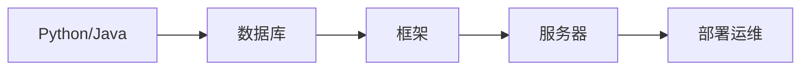

# 知识体系地图

#知识图谱 #学习路线

这是一个可视化的知识体系概览，展示了各个知识领域之间的关联关系。

## 核心技能树

## 知识关联图

## 学习路径

### 1. Web开发路线

### 2. 后端开发路线

### 3. 安全技术路线

## 技能关联

### 前端开发
- [[javascript/README|JavaScript]] ↔ [[html/README|HTML]]/[[css/README|CSS]]
- [[vue/README|Vue.js]] ↔ [[javascript/README|JavaScript]]
- [[threejs/README|Three.js]] ↔ [[javascript/README|JavaScript]]

### 后端开发
- [[python/README|Python]] ↔ [[SQL Server/README|数据库]]
- [[java/README|Java]] ↔ [[SQL Server/README|数据库]]
- [[Linux/README|Linux]] ↔ 服务器部署

### 全栈技能
- 前端 ↔ 后端 ↔ 数据库
- 开发 ↔ 测试 ↔ 部署
- 基础设施 ↔ 应用开发 ↔ 性能优化

## 实践项目

### Web应用开发
1. 前端
   - [[项目/前端/组件库|UI组件库]]
   - [[项目/前端/管理系统|管理系统]]

2. 后端
   - [[项目/后端/接口服务|API服务]]
   - [[项目/后端/数据处理|数据处理]]

3. 全栈
   - [[项目/全栈/博客系统|博客系统]]
   - [[项目/全栈/电商平台|电商平台]]

## 学习资源

### 官方文档
- [[资源/官方文档|文档导航]]
- [[资源/教程列表|精选教程]]

### 实践平台
- [[资源/练习平台|编程练习]]
- [[资源/项目实战|实战项目]]

## 相关链接

- [[README|知识库首页]]
- [[模板/README|笔记模板]]
- [[搜索技巧|搜索指南]]

#知识管理 #学习方法 #技能树 